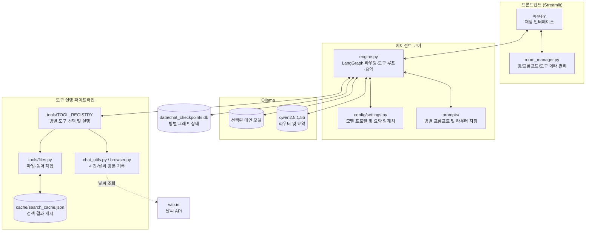

## 프로젝트 개요

Ollama에서 실행하는 로컬 LLM과 LangGraph를 이용해 대화, 파일 작업, 시간·날씨 조회, Chrome 방문 기록 조회를 제공하는 Python 프로젝트입니다. Streamlit 웹 UI와 별도의 터미널 CLI를 포함합니다.

모델 추론과 파일 처리는 로컬에서 수행하므로 데모 URL은 제공되지 않습니다.
대신 GitHub에서 소스코드를 확인하실 수 있습니다.
단, 날씨 도구는 `wttr.in`에 요청하므로 해당 기능 사용 시 네트워크 연결이 필요합니다.

---

## 📌 주요 특징 (Key Highlights)

- **로컬 추론**: Ollama 모델 프로필을 선택해 사용하며, 현재 기본 프로필은 Qwen 3.5 계열 9B 모델
- **도구 실행**: LangGraph에서 방별로 선택된 도구를 실행하며, 파일 검색 결과는 로컬 캐시에 저장
- **대화 관리**: 채팅방별 SQLite 체크포인트와 컨텍스트 요약 노드 사용
- **모듈 구성**: 프롬프트와 도구를 분리하고, Streamlit에서 방별로 선택 가능

## 기술 스택
UI부터 로컬 모델 실행과 대화 상태 저장까지 Python 생태계의 구성 요소를 사용합니다.

| 구분 | 기술 |
|---|---|
| 언어 | Python 3.10+ |
| 웹 UI | Streamlit |
| 에이전트 그래프 및 오케스트레이션 | LangGraph |
| LLM 통합 | LangChain Core, `langchain-ollama` |
| 로컬 모델 서빙 | Ollama |
| 대화 상태 저장 | SQLite, LangGraph SQLite Checkpointer |

## 모델 특징 비교
`progress/model_test_results.md`의 기록을 요약했습니다. 모델별 결과는 현재 작성된 테스트 메모 기준이며, 테스트가 진행 중인 모델은 제외했습니다.

| 모델 | 관찰된 특징 |
|---|---|
| Qwen 2.5 Coder 14B | 프롬프트 이행이 미흡하고 도구 호출 및 캐릭터 대화에 부적합한 것으로 기록됨 |
| Qwen 2.5 14B Instruct | 도구 호출은 수행하지만 한국어 대화에서 중국어가 섞이는 경우가 있었고, 결과 보고 지시나 브라우저 기록 조회 지시 이행이 미흡함 |
| Qwen 3.5 9B | 프롬프트 이행과 도구 호출은 양호하나, 일부 상황에서 추론이 길어지거나 도구 호출 루프가 반복됨 |
| Gemma 4 12B | 라우터 오분류 상황에서도 파일 도구를 호출한 사례가 있었으나, 브라우저 기록 조회는 도구가 분류된 뒤에도 거부한 사례가 기록됨 |

---

## 🛠️ 시스템 아키텍처 및 디렉토리 구조

### 시스템 아키텍처



Streamlit은 방별 프롬프트와 도구 스키마를 엔진에 전달합니다. 엔진은 먼저 라우터로 시간·날씨·브라우저 요청을 분류한 뒤, 그 외 요청에는 선택된 도구를 제공하고 대화가 길어지면 요약합니다. CLI(`agent.py`)는 별도의 Ollama 도구 루프를 제공합니다.

### 디렉토리 구조

```
LocalAgent/
├── app.py                     # Streamlit 웹 UI
├── agent.py                   # Ollama 기반 CLI
├── engine.py                  # LangGraph 실행, 스트리밍 및 SQLite 체크포인트
├── room_manager.py            # 방 템플릿과 프롬프트/도구 목록
├── config/
│   ├── __init__.py
│   ├── categories.py          # 파일 카테고리와 제외 폴더
│   └── settings.py            # 경로, 모델 프로필, 요약 기준
├── prompts/
│   ├── system/00_router.md    # 요청 의도 분류 지침
│   ├── 01_persona.md
│   ├── 02_chat.md
│   ├── 03_files.md
│   └── 04_agent_workflow.md
├── tools/
│   ├── __init__.py            # 스키마 및 LangChain 도구 레지스트리
│   ├── files.py               # 파일·폴더 검색, 읽기/쓰기/이동/삭제
│   ├── chat_utils.py          # 시간 및 날씨 조회
│   └── browser.py             # Chrome 방문 기록 조회
├── cache/                     # 검색 결과 캐시
├── data/                      # 실행 중 chat_checkpoints.db 생성
├── search_result/             # 검색 결과 내보내기
├── progress/                  # 작업 기록, 트러블슈팅, 모델 검증 기록
├── legacy/                    # 이전 구현 파일
├── test_graph.py              # 그래프 동작 확인 스크립트
├── test_ollama.py             # Ollama 모델 확인 스크립트
└── requirements.txt
```

## ⚙️ 주요 기능
### 1. 지능형 파일 시스템 제어
- 폴더/파일 검색, 텍스트 파일 읽기·쓰기·이동, 휴지통 이동 및 검색 결과 내보내기를 제공합니다.
- 파일 검색은 카테고리와 용량 범위 조건을 지원하며, 재귀 검색은 최대 50,000개 검사 제한을 둡니다.
- 검색 결과는 `cache/search_cache.json`에 임시 저장하고 내보내기 파일은 `search_result/`에 저장합니다.

### 2. 모듈형 방(Room) 관리 및 동적 툴 바인딩
- Streamlit에서 방을 만들고 방별 프롬프트와 도구를 선택할 수 있습니다.
- 시간, 날씨, Chrome 방문 기록 조회는 라우터 분류를 사용하고, 파일 요청을 포함한 일반 요청은 선택된 도구를 모델에 제공합니다.

### 3. 대화 및 모델 실행
- Ollama 모델 프로필을 UI에서 선택할 수 있으며, 기본 메인 모델은 Qwen 3.5 계열 9B입니다. 라우터와 요약에는 `qwen2.5:1.5b`를 사용합니다.
- LangGraph 상태는 방 ID를 기준으로 `data/chat_checkpoints.db`에 저장됩니다.
- 기본 12,000 토큰 기준을 넘으면 이전 대화를 요약하고 최근 4개 메시지를 유지합니다. UI는 본문과 `<think>` 출력을 스트리밍해 표시합니다.

## 참고 사항
- 날씨 조회는 `wttr.in` 외부 API에 연결합니다. 나머지 LLM 추론 및 파일 작업은 로컬 환경에서 처리됩니다.
- `data/`, `cache/`, `search_result/`에는 실행 중 데이터가 생성됩니다. 대화 체크포인트는 `data/chat_checkpoints.db`에 저장됩니다.

## 🚀 시작하기
- 요구 사양
    - Python 3.10+
    - Ollama 런타임
    - 필요한 GPU 메모리는 선택 모델, 양자화, 컨텍스트 설정에 따라 달라집니다.

## 설치 및 환경 설정
```powershell
python -m venv .venv
.\.venv\Scripts\Activate.ps1
python -m pip install -r requirements.txt
```

Git Bash 또는 Linux/macOS에서는 가상환경을 다음처럼 활성화합니다.

```bash
source .venv/Scripts/activate  # Windows Git Bash
# 또는 source .venv/bin/activate
```

## 로컬 LLM 서빙 (Ollama)
```bash
ollama pull fredrezones55/Qwen3.5-Uncensored-HauhauCS-Aggressive:9b
ollama pull qwen2.5:1.5b
```

설정된 다른 선택 모델은 `config/settings.py`의 `MODEL_PROFILES`에서 확인할 수 있습니다.

## 실행
```bash
# Streamlit 웹 UI
streamlit run app.py

# 별도 터미널에서 CLI 에이전트 실행
python agent.py
```

## 개발 자료
- `progress/work-log.md`: 작업 기록
- `progress/troubleshooting.md`: 문제 해결 기록
- `progress/model_test_results.md`: 모델 테스트 메모