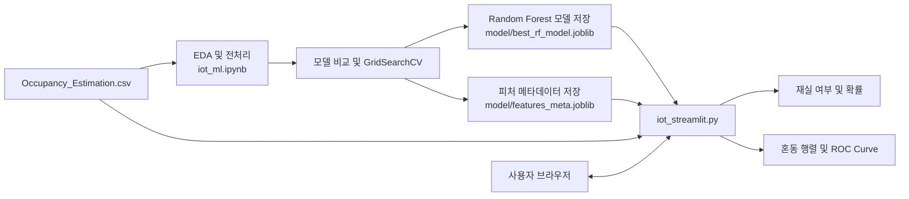
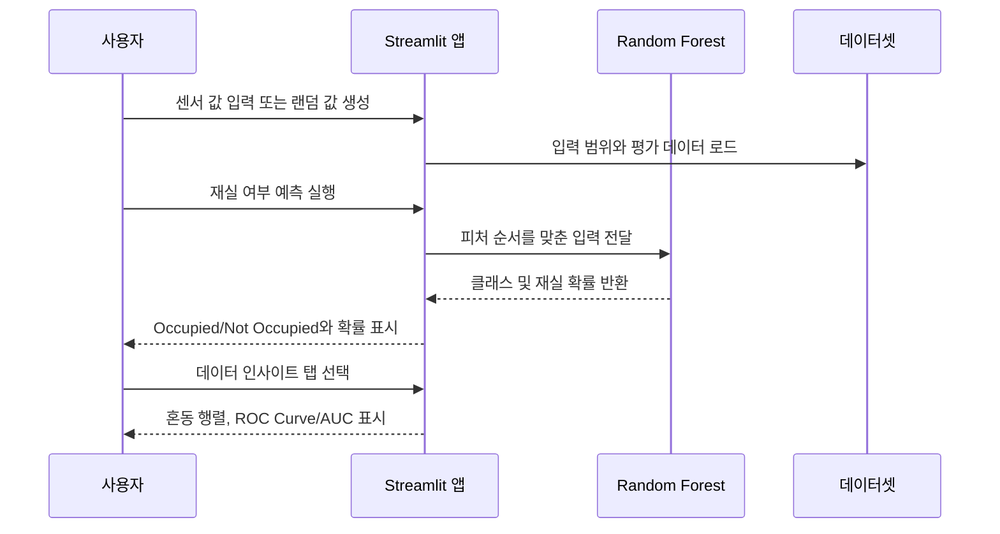

## 프로젝트 개요

IoT 환경 센서 데이터(온도, 조도, CO2, 소리, PIR 모션 감지 등)를 이용해 실내 재실 여부를 `Occupied` 또는 `Not Occupied`로 분류하는 머신러닝 기반 Streamlit 애플리케이션입니다.

센서 값을 직접 입력하거나 데이터셋 범위에서 무작위 값을 생성하면 학습된 Random Forest 모델이 재실 여부와 재실 확률을 즉시 반환합니다. 별도의 프론트엔드 서버 없이 Streamlit 대시보드에서 예측과 모델 평가 결과를 함께 확인할 수 있습니다.

[서비스 접속 링크](https://iotmodel.streamlit.app/)

Streamlit 배포 정책상 12시간 동안 트래픽이 발생하지 않으면 서버가 휴면 상태에 들어갈 수 있습니다. 접속 시 기동 안내가 표시되면 **AWAKE 버튼**을 클릭해 서비스를 깨운 뒤 이용해 주세요.

## 기획 배경 및 문제 정의

실내 공간의 재실 상태를 수동으로 확인하거나 고정된 일정으로 관리하면 에너지 절감, 공조 제어, 공간 운영 자동화에 한계가 있습니다. 다양한 환경 센서 신호를 바탕으로 현재 공간이 사용 중인지 추정하면 불필요한 조명·냉난방·환기를 줄이고 공간 관리 의사결정을 지원할 수 있습니다.

이 프로젝트는 다음 문제를 다룹니다.

- 여러 센서 값을 하나의 재실 여부 판단으로 통합
- 원본 인원 수(`Room_Occupancy_Count`)를 이진 타깃(`Occupancy`)으로 변환
- 여러 분류 모델을 비교하고 F1-Score 중심으로 모델을 선정
- 학습된 모델을 실제 입력을 받는 웹 대시보드로 제공

## 보고서

| 모델 학습 및 성능 최적화 보고서 |
| :---: |
| [](https://drive.google.com/file/d/1yPk7ZXgzExdGwNyQSe_84FRcHoraJCpV/view?usp=sharing)|
| [보고서.PDF](https://drive.google.com/file/d/1yPk7ZXgzExdGwNyQSe_84FRcHoraJCpV/view?usp=sharing) |

## 시연 영상 및 서비스 화면

### 시연 영상

[](https://youtu.be/MS3Gb3q3yms)


### 서비스 화면

| 재실 여부 예측 | 예측 평가 |
| :---: | :---: |
|  |  |

## 주요 기능

### 1. 예측에 필요한 값 입력
- **센서 입력 UI**: 온도·조도·소음·CO2·PIR 그룹별 입력 필드 제공
- **입력 보조 기능**: 온도·조도 슬라이더, 소음·CO2의 낮음/보통/높음 단계 선택 지원
- **랜덤 센서 값 생성**: 데이터셋의 각 피처 최솟값과 최댓값 사이에서 테스트용 값을 자동 생성

### 2. 예측
- **실시간 재실 예측**: 센서 입력값을 모델에 전달해 `Occupied` / `Not Occupied`를 분류
- **확률 출력**: `predict_proba`를 이용해 재실 확률을 백분율로 표시
- **모델 리소스 캐싱**: `st.cache_resource`와 `st.cache_data`로 모델 및 샘플 데이터 로드 비용 절감

### 3. 평가
- **모델 평가 시각화**: 혼동 행렬과 ROC Curve/AUC를 Streamlit 탭에서 확인

## 기술 스택

| 구분 | 기술 |
| --- | --- |
| 언어 | Python 3.10+ |
| 웹 대시보드 | Streamlit |
| 데이터 처리 | pandas, NumPy |
| 시각화 | Matplotlib, Seaborn |
| 머신러닝 | scikit-learn |
| 모델 저장/로드 | joblib |
| 분석 환경 | Jupyter Notebook |

주요 모델 비교 대상은 Logistic Regression, Decision Tree, Random Forest, Gradient Boosting, Calibrated SVM, K-Nearest Neighbors입니다.

## 모델 성능 비교 및 평가

### 실험 설정

- 비교 실험: `train_test_split(test_size=0.2, random_state=42)`
- 최종 Random Forest 튜닝: `GridSearchCV(cv=5, scoring='f1')`
- 튜닝 단계에서는 타깃 비율 유지를 위해 `stratify=y`를 사용
- 평가 지표: Accuracy, Precision, Recall, F1-Score, ROC-AUC
- 다중공선성 검토 후 제거 후보: `S2_Temp`, `S3_Temp`, `S4_Temp`, `S2_Light`, `S3_Light`

### 모델 비교표

| 모델 | Accuracy | Precision | Recall | F1-Score | ROC-AUC |
| --- | ---: | ---: | ---: | ---: | ---: |
| Logistic Regression | 0.9956 | 0.9941 | 0.9877 | 0.9889 | 0.9986 |
| Decision Tree | 0.9968 | 1.0 | 0.9929 | 0.9964 | 0.9963 |
| Random Forest | **1.0** | **1.0** | **1.0** | **1.0** | **1.0** |
| Gradient Boosting | 0.9980 | 1.0 | 0.9902 | 0.9951 | 0.9997 |
| Calibrated SVM | 0.9832 | 1.0 | 0.9165 | 0.9541 | 0.9701 |
| K-Nearest Neighbors | 1.0 | 1.0 | 1.0 | 1.0 | 1.0 |

### 평가 산출물

| 예측 결과 | ROC |
| --- | --- |
| (혼동 행렬 이미지) | (ROC 커브) |

## 시스템 파이프라인 및 상호작용 흐름

### 시스템 아키텍처



### 사용자 상호작용 흐름



## 연구 보고서 및 실험 문서

| 모델 학습과 성능 개선 |
| --- |
| (이미지) |
| [모델 학습 보고서](https://drive.google.com/file/d/1yPk7ZXgzExdGwNyQSe_84FRcHoraJCpV/view?usp=sharing) |

### 모델 학습 파라미터
```powershell
하이퍼파라미터: {
    'max_depth': None,
    'max_features': 'sqrt',
    'min_samples_leaf': 1,
    'min_samples_split': 10,
    'n_estimators': 100
}
F1 score: 0.9990147730209319
```

## 프로젝트 디렉토리 구조

```text
MLPRJ/
├── iot_streamlit.py                # Streamlit 웹 대시보드
├── iot_ml.ipynb                    # EDA, 모델 비교, 튜닝 및 평가
├── requirements.txt                # Python 의존성
├── dataset/
│   └── Occupancy_Estimation.csv    # 학습 및 평가용 데이터셋
├── model/
│   ├── best_rf_model.joblib        # 튜닝된 Random Forest 모델
│   └── features_meta.joblib        # 모델 입력 피처 메타데이터
└── report/
    └── eda_report_original.html    # EDA 리포트
```

## 실행 방법

### 사전 요구사항 및 의존성 설치

- Python 3.10 이상
- pip

```powershell
python -m venv .venv
.\.venv\Scripts\Activate.ps1
python -m pip install --upgrade pip
pip install -r requirements.txt
```

PowerShell 실행 정책으로 가상환경 활성화가 차단되면 현재 사용자 범위에서 다음 명령을 실행한 뒤 다시 활성화하세요.

```powershell
Set-ExecutionPolicy -Scope CurrentUser -ExecutionPolicy RemoteSigned
```

### 로컬 실행

```powershell
streamlit run iot_streamlit.py
```

실행 후 브라우저에서 `http://localhost:8501`에 접속합니다.

## 핵심 트러블슈팅 및 배운 점

### 트러블슈팅

| 증상 | 확인할 사항 |
| --- | --- |
| ydata-profiling 실행환경 구성 문제 | 프로파일링 라이브러리와 기존 라이브러리의 충돌, 프로파일링 자료 산출을 위한 별도의 환경을 구성해 해결 |
| 기존 작업환경의 matplotlib 모듈 오류 | 프로파일링 환경과 분리되었음에도 모듈 충돌 발생, 커널 및 메모리 초기화로 기존 환경과의 충돌 해결 |
| GitHub 커밋 문제 | ipynb 파일의 변경사항이 너무 많아 추적 불가능한 문제 발생, gitignore에 체크포인트를 명시해 해결 |

### 배운 점

- 도메인 선정부터 배포까지 전체 과정을 직접 수행하며 머신러닝 개발의 전반적인 워크플로우를 이해
- 각 단계의 결과가 다음 단계의 판단과 연결되는 과정을 직접 경험하며, 데이터 기반 의사 결정의 중요성에 대해 이해

### 향후 발전 계획

- 모델 성능 및 범용성 향상
    - 다양한 환경 및 센서 데이터를 추가하여 모델의 일반화 성능을 검증하고 지속적으로 개선
- 스마트홈 서비스 연계
    - 재실 여부 판단 결과를 활용하여 가전기기 제어, 사용자 알림 등 스마트홈 서비스로 확대
- 개인정보 보호를 고려한 재실 관리 시스템 고도화
    - 현재의 비영상 센서 방식을 유지하며 사생활 침해 우려를 최소화하는 관리 시스템으로 발전
- 다양한 실내 환경으로 적용 범위 확대
    - 주거 공간뿐만 아니라 사무실, 회의실 등 다양한 실내 공간에 적용 가능하도록 모델 확장

## 데이터셋 출처 및 참고 사항

- 데이터셋 제공 플랫폼: [UCI Machine Learning Repository](https://archive.ics.uci.edu/)
- 원본 데이터셋 링크: [Room Occupancy Estimation Data Set](https://archive.ics.uci.edu/dataset/864/room+occupancy+estimation)
- 데이터셋 작성자: Adarsh Pal Singh, Sachin Chaudhari
- 원본 라이선스: [CC BY 4.0](https://creativecommons.org/licenses/by/4.0/legalcode.ko)

본 프로젝트는 비영리 목적의 학습 및 포트폴리오용 프로젝트입니다. 성능 수치는 데이터 분할, 전처리, 라이브러리 버전에 따라 달라질 수 있으므로 실제 배포 판단 전 별도의 검증 데이터와 운영 환경 평가가 필요합니다.
