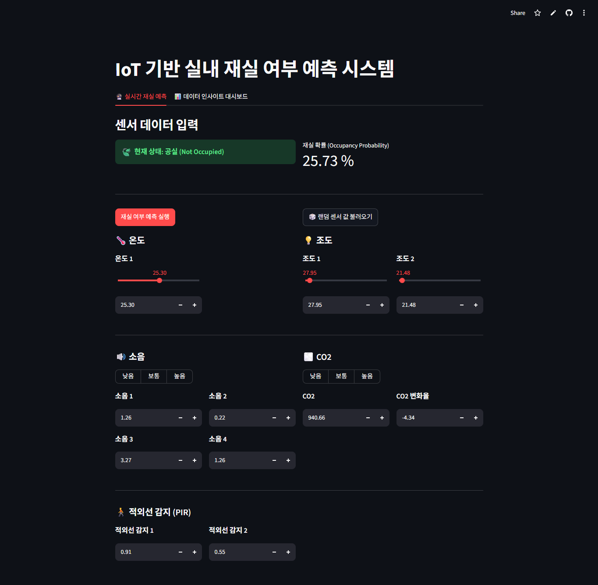
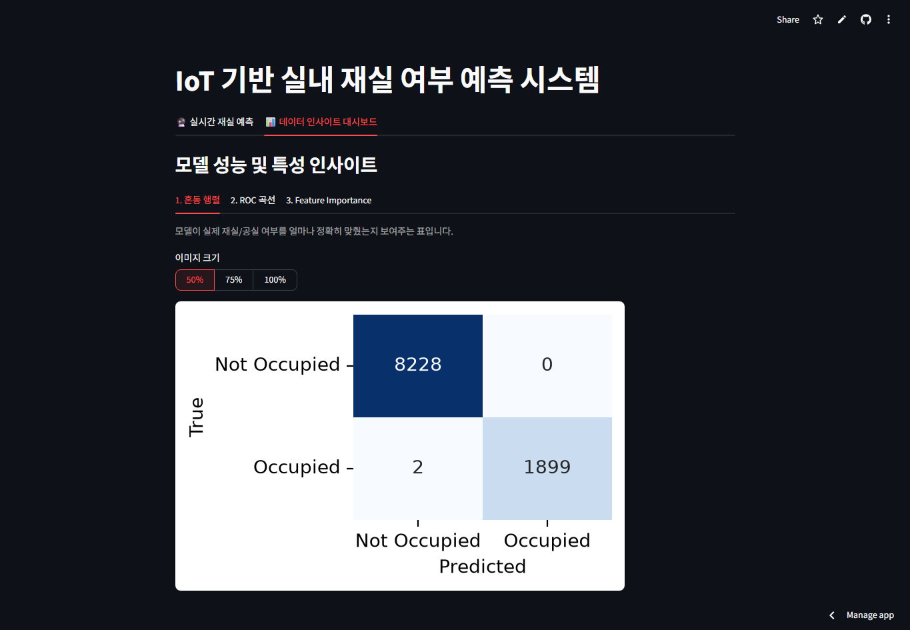
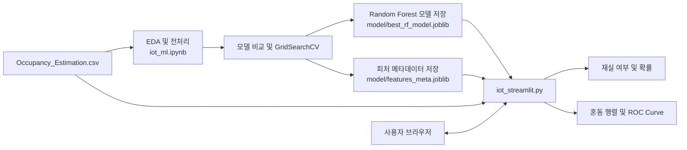

## 📌 개요 (Overview)
- **형태**: 머신러닝 개인 프로젝트
- **서비스 링크**: [Streamlit Live Demo](https://iotmodel.streamlit.app/)
- **배경**: 실내 공간의 재실 상태를 수동으로 관리할 경우 발생하는 불필요한 냉난방, 조명, 환기 에너지 낭비를 줄이고자 기획했습니다. 카메라 기반 영상 센서 대신 사생활 침해 우려가 없는 환경 센서(온도, 조도, CO2, 소리, PIR 모션 등)를 통합하여 공간 재실 여부를 정밀하게 추정합니다.

---

## 연구 보고서

| 모델 학습과 성능 개선 |
| --- |
| (이미지) |
| [모델 학습 보고서](https://drive.google.com/file/d/1yPk7ZXgzExdGwNyQSe_84FRcHoraJCpV/view?usp=sharing) |

---

## 🛠️ 핵심 기능 (Key Features)

- **센서 입력 & 시뮬레이션 UI**: 온도, 조도, 소음, CO2, PIR 값을 슬라이더와 단계별 선택으로 직접 조정하거나 원본 데이터셋 범위 내 무작위 생성 지원.
- **실시간 추론 및 확률 시각화**: 입력된 센서 값을 기반으로 재실 여부(`Occupied` / `Not Occupied`) 판정 및 `predict_proba` 기반 신뢰도 백분율 출력.
- **데이터 인사이트 및 모델 평가 탭**: 혼동 행렬(Confusion Matrix)과 ROC-AUC 커브를 대시보드 내에서 즉시 시각화 확인 가능.

| 재실 여부 예측 | 예측 평가 |
| :---: | :---: |
|  |  |

---

## 🏗️ 시스템 파이프라인 (System Pipeline)

- **데이터 파이프라인**: UCI Room Occupancy Estimation 데이터셋의 다중 센서 데이터를 분석하고, 원본 인원 수를 이진 타깃(재실/공실)으로 정제.
- **모델 서빙 파이프라인**: 학습 완료된 Random Forest 파이프라인(`best_rf_model.joblib`)과 피처 메타데이터를 Streamlit 상에서 경량 로드하여 실시간 추론 제공.

---

## 📊 모델 실험 및 성능 검증 (Model Benchmark)

Logistic Regression, Decision Tree, Random Forest, Gradient Boosting, Calibrated SVM, KNN 등 6개 모델을 비교 실험하여 F1-Score를 기준으로 최종 모델을 채택했습니다.

| 모델 | Accuracy | Precision | Recall | F1-Score | ROC-AUC |
| :--- | :---: | :---: | :---: | :---: | :---: |
| Logistic Regression | 0.9956 | 0.9941 | 0.9877 | 0.9889 | 0.9986 |
| Decision Tree | 0.9968 | 1.0 | 0.9929 | 0.9964 | 0.9963 |
| **Random Forest (Final)** | **1.0** | **1.0** | **1.0** | **1.0** | **1.0** |
| Gradient Boosting | 0.9980 | 1.0 | 0.9902 | 0.9951 | 0.9997 |
| Calibrated SVM | 0.9832 | 1.0 | 0.9165 | 0.9541 | 0.9701 |
| K-Nearest Neighbors | 1.0 | 1.0 | 1.0 | 1.0 | 1.0 |

> **최종 튜닝 파라미터**: `n_estimators=100`, `max_depth=None`, `min_samples_split=10`, `min_samples_leaf=1` (GridSearchCV 5-Fold F1-Score: **0.9990**)

---

## 🚀 문제 해결 및 최적화 (Troubleshooting)

### 1. 프로파일링 라이브러리 간 모듈 및 의존성 충돌
- **문제**: 데이터 프로파일링을 위해 `ydata-profiling` 환경을 구성하는 과정에서 기존 시각화 라이브러리(`matplotlib`) 및 커널 메모리 간 충돌 발생.
- **해결**: 데이터 분석/프로파일링용 별도 가상환경을 분리 격리 구성하고 커널 프로세스 초기화로 의존성 전이 간섭을 원천 차단.

### 2. Streamlit 대시보드 응답 지연 및 자원 낭비 개선
- **문제**: 사용자가 센서 값을 변경할 때마다 대용량 모델 파일과 평가 데이터셋을 디스크에서 매번 다시 읽어오는 오버헤드 발생.
- **해결**: Streamlit의 `st.cache_resource`(모델 파이프라인 캐싱) 및 `st.cache_data`(평가 샘플 데이터 캐싱) 데코레이터를 적용하여 메모리 재사용 구조로 전환.
- **성과**: 재실행 시 모델 I/O 지연을 제거하여 슬라이더 조작 즉시 예측 결과가 반영되는 실시간성 확보.

### 3. Git 대용량 분석 노트북 변경사항 추적 문제
- **문제**: `iot_ml.ipynb` 내 그래프 출력 결과물로 인해 변경 diff가 비대해져 커밋 히스토리 추적이 어려워짐.
- **해결**: `.gitignore`에 주피터 체크포인트 경로를 명시하고 분석 노트북의 산출물과 실제 서빙 코드를 디렉터리 단위로 엄격히 분리 관리.

---

## 💡 회고 및 향후 과제 (Retrospective)
- **배운 점**: 단순 모델 학습에 그치지 않고, 센서 데이터 전처리부터 웹 서빙 및 클라우드 배포까지 머신러닝 개발 수명 주기(ML Lifecycle) 전 과정을 직접 구현하며 데이터 기반 의사결정 프로세스를 정립함.
- **향후 계획**: 회의실/오피스 등 다양한 도메인 환경의 데이터셋 수집 및 스마트홈 IoT 가전 제어 API와의 연동 확대.