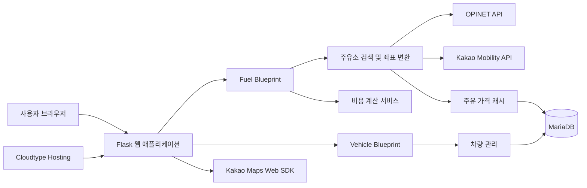

## 📌 서비스 소개 및 배경
- **개발 형태**: 5인 팀 프로젝트 (기획/문서, 백엔드, 프론트엔드, 인프라)
- **서비스 링크**: [Cloudtype Live Demo](https://port-0-oilandcharge-mstwa15r85de9006.sel3.cloudtype.app/)
- **기획 배경**: 단순한 주유소별 리터당 판매 가격뿐만 아니라, 주유소까지 오가는 왕복 이동 비용(거리 및 차량 연비 반영)을 함께 고려하여 운전자에게 실질적인 최저 비용 주유소를 안내하고자 기획되었습니다.

---

## 🚀 주요 기능

- **주변 주유소 탐색 및 지도 마커 표시**: 반경 내 주유소 정보 조회 및 Kakao Maps Web SDK를 통한 위치 시각화
- **차량 연비 기반 실질 비용 산출**: 등록 차량의 공인 연비, 이동 거리, 주유량을 합산하여 왕복 이동비와 총 소요 비용 자동 계산
- **차량 관리**: 사용자별 차량 등록 및 연비/유종 데이터 조회 기능
- **조회 성능 최적화**: 외부 유가 API(OPINET) 호출 결과의 MariaDB 캐싱 처리

---

## 🏗️ 시스템 아키텍처 및 파이프라인

- 좌표 변환 파이프라인: WGS84 좌표를 OPINET API 전용 KATEC/TM128 좌표로 실시간 변환하고, 응답받은 유가 정보를 다시 WGS84로 변환하여 지도 상에 마커로 렌더링.
- 비즈니스 로직 분리: Blueprint 기반으로 유가 검색/비용 계산 모듈(app/fuel/)과 차량 관리 모듈(app/vehicle/)을 분리 설계.

## 💡 향후 개선 계획
- 지원 범위 확대: 전기차 충전소, 경유, LPG 등 유종 및 인프라 탐색 확장
- 사용자 편의성 향상: 지도 마커와 주유소 목록 간의 양방향 인터랙션 개선 및 즐겨찾기 기능 추가
- 인증 및 개인화: 사용자 인증 도입을 통한 개인별 계산 이력 관리 및 다중 차량 제어 지원